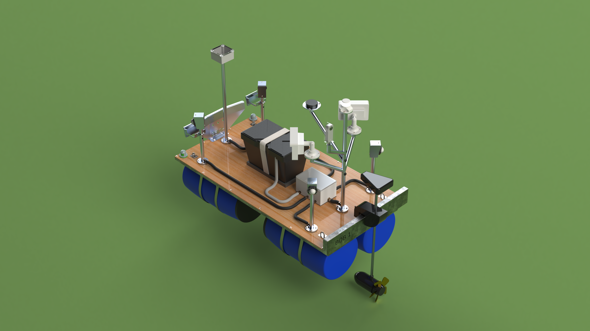
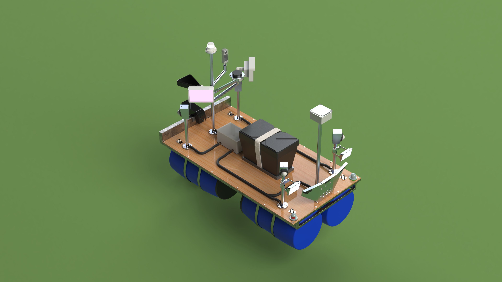

# PISO-AID | Bob 1
### A small semi-autonomous pontoon research prototype

**Project lead:** Jason Vaughn Holmes  
**Status:** Design development and prototype planning  
**Updated:** 8 September 2026

## The project
Bob 1 explores a small waterborne platform for supervised cargo and remote-observation experiments. It is intended to provide a practical foundation for integrating propulsion, sensing, telemetry and limited autonomous navigation.

The original project brief envisages prototype fabrication in South Korea and possible later adaptation for Lake Piso, Liberia. Larger-scale suitability and local operating needs remain to be validated.

## What exists today
A mechanical and electrical design archive, fabrication drawing set, component references and high-level system documentation have been assembled. A document review identified configuration and integration issues to resolve before establishing an approved build.

Operational autonomy, payload, endurance and field performance have not been verified in the reviewed evidence. This repository currently contains project documentation, not working control software.

## Design visuals

| Isometric view 02 | Isometric view 04 |
|---|---|
|  |  |

### Exploded-view animation

The uploaded renderings and animation illustrate the design concept. They do not establish a built or tested prototype. [Open the animation](assets/bob1-exploded-view.gif).

See the [system overview](docs/system-overview.md) for the general arrangement and original system block diagram.

## Development roadmap

The six phases run from design reconciliation through next-stage funding. Completion, dates and funding amounts are not implied.

Read the [roadmap](docs/roadmap.md), [current status](docs/status.md) and [system overview](docs/system-overview.md).

## Collaboration and future funding
Areas of interest include marine/mechanical design review, embedded control, robotics, test planning, fabrication and prospective operating partners. These are collaboration interests, not confirmed partnerships.

Future support would help fund engineering reconciliation, components, integration and documented testing. Funding amount, schedule and program eligibility will be established from a scoped work plan and current opportunity requirements.

See the [funding overview](docs/funding-overview.md) and [collaboration guide](CONTRIBUTING.md).

## Learn more
Contact [Jason on GitHub](https://github.com/jvholmes87) or open a general inquiry using this repository's issue template. For a deeper technical discussion, a separate private review package is available by arrangement with the project lead.

## Documentation and rights
This public repository presents project intent, development status and plans. Detailed source records are maintained separately. No open-source license is assigned in this initial release; publishing this overview does not grant rights to commissioned designs or supplier assets.

Any concept illustrations or animations are illustrative only and are not evidence of successful operation or verified CAD geometry.

