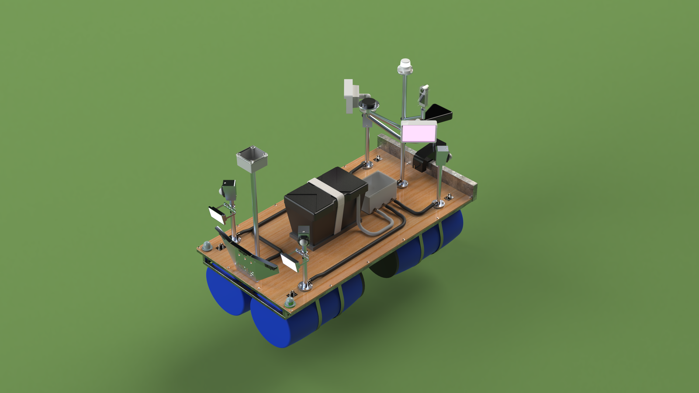
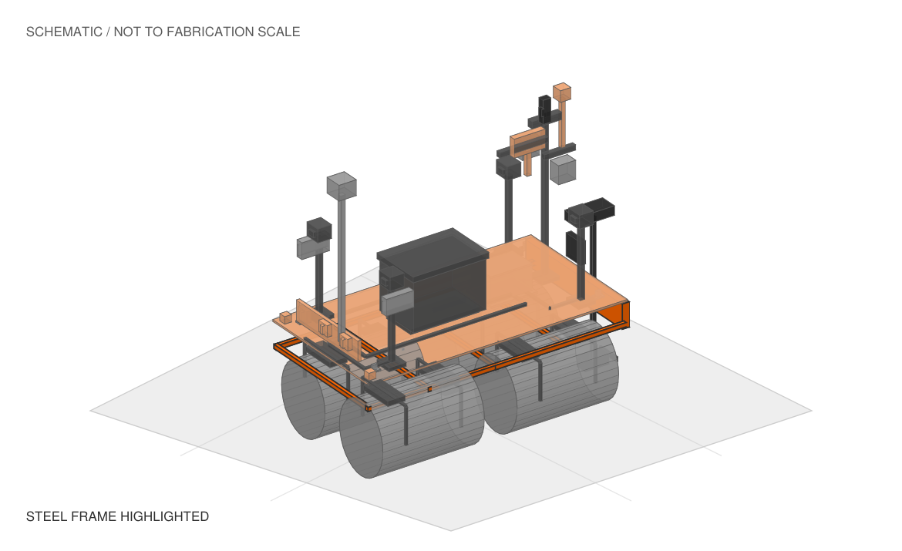
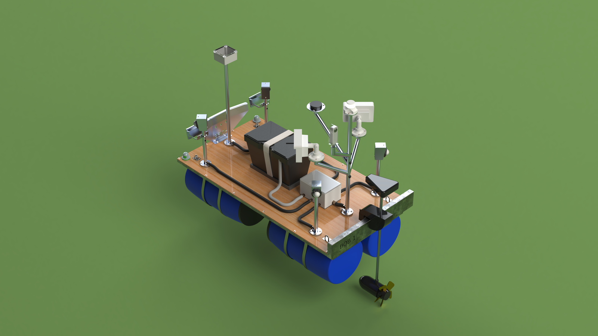
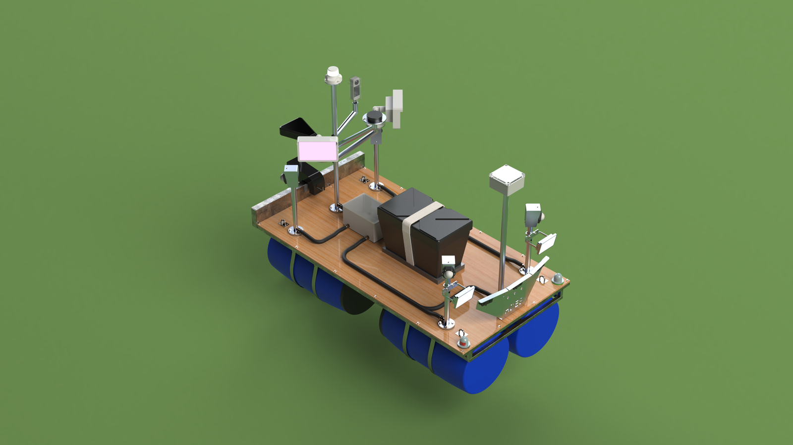
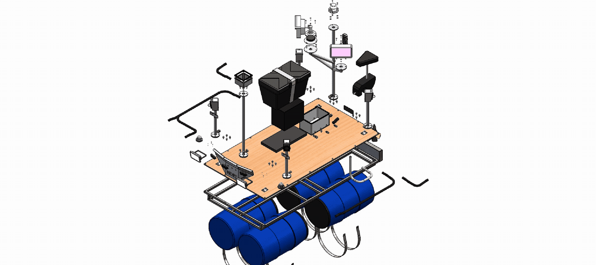
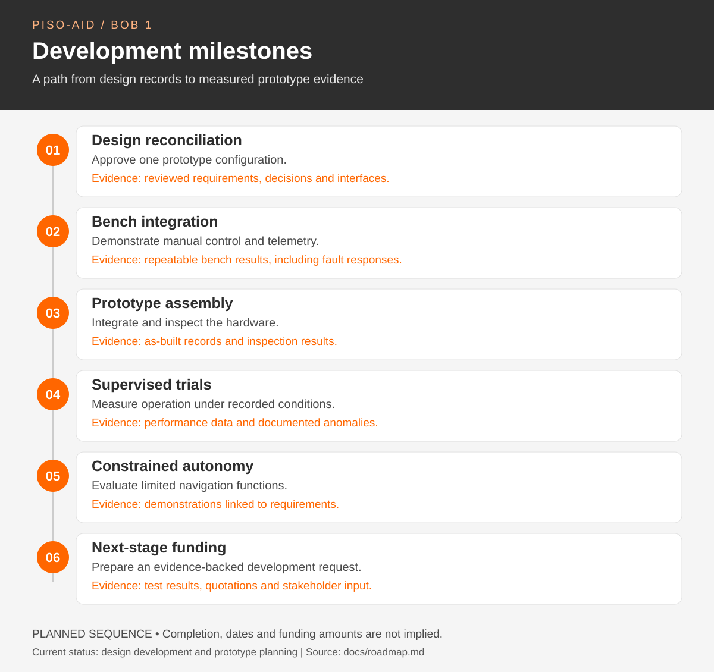

# PISO-AID | Bob 1
### A small uncrewed surface vehicle (USV) research prototype for supervised autonomy

**Owning entity:** HDES (U.S. LLC formation in progress)  
**Project lead:** Jason Von Holmes  
**Status:** Design development and prototype planning  
**Updated:** 7 October 2026

## The problem

U.S. inland waterways carry nearly 500 million tons of freight annually. The U.S. mariner shortage has been described as a strategic national-security concern, and the NTSB found operator fatigue caused a 2023 towboat-pier allision on the Lower Mississippi River. During the 2022 Mississippi River low-water event, loading drafts were reduced to 9 ft 6 in, cutting tons per barge by roughly 20–27%. These conditions motivate research into ways supervised autonomy, better telemetry, and lower-draft platforms could support safer and more flexible operations without assuming that autonomy replaces required crews.

## The approach

PISO-AID explores supervised autonomy on low-cost, shallow-draft platforms. Bob 1 is a small uncrewed surface vehicle (USV) test platform intended to develop and validate navigation, telemetry, data logging, and supervised-operation methods before scaling.

The proposed control architecture uses an industry-standard small-USV autopilot approach: a CubePilot Cube Orange+ running ArduPilot Rover in boat configuration, with the Holybro Pixhawk 6X retained as an alternative. These components are proposed and have not been purchased, integrated, or tested.

Full-scale vessels are envisioned as **crewed** platforms with supervised autonomy, consistent with current U.S. Coast Guard crewing requirements.

## Applications

**Primary applications**
- U.S. inland waterway freight research
- Port and terminal operations research

**Secondary applications**
- Remote observation
- Small-lot cargo movement
- Possible later adaptation for Lake Piso, Liberia, subject to local needs, permissions, and validation

## What exists today

A mechanical and electrical design archive, fabrication drawing set, component references and high-level system documentation have been assembled. A document review identified configuration and integration issues to resolve before establishing an approved build.

Operational autonomy, payload, endurance and field performance have not been verified in the reviewed evidence. No prototype has been built or water-tested. This repository contains project documentation and a runnable visual explorer; vehicle-control software is not included.

See the [current status](docs/status.md).

## Interactive visual explorer

The owner-approved **Visual Explorer v0.3** adds a rotatable assembled/exploded view, selectable components, a 30-row parts index and a flotation scenario calculator. It uses the official HDES logo and orange/charcoal palette, with Metric, Imperial (US), and Both measurement displays.

**Run it:** [Open the hosted BOB 1 Visual Explorer](https://jvholmes87.github.io/piso-aid-bob1/visual-explorer/). It runs directly in your browser through this repository's GitHub Pages site. [Source and instructions](docs/visual-explorer/README.md) · [Calculation and source basis](docs/visual-explorer/SOURCE_REGISTER.md). The single-file HTML remains available for optional offline use.

The assembly remains schematic; small hardware is grouped and enclosure internals are not individually modeled. The calculator does not establish safe payload or stability. Exact Facundo/Scandia webfonts and real-browser layout verification remain outstanding.

## Design visuals

| Isometric view 02 | Isometric view 04 |
|---|---|
|  |  |

### Exploded-view animation

The uploaded renderings and animation illustrate the design concept. They do not establish a built or tested prototype. [Open the animation](assets/bob1-exploded-view.gif).

See the [system overview](docs/system-overview.md) for the general arrangement and original system block diagram.

## Research questions

The project is organized around measurable technical uncertainties in navigation, operator intervention, payload economics, and evidence-quality telemetry.

Read [Research questions](docs/research-questions.md), [Acceptance criteria](docs/acceptance-criteria.md), [Test plan](docs/test-plan.md), and [Proposed control architecture](docs/control-architecture.md).

## Development roadmap

### Scaling view

| Stage | Purpose | Evidence produced | Likely funding fit |
|---|---|---|---|
| Bob 1 (USV test platform) | Prove supervised navigation at small scale | Test logs vs. acceptance criteria | Self-funded / small grants |
| Bob 2 (cargo prototype) | Cargo handling, endurance, shallow-draft performance | Payload and endurance data | NSF SBIR/STTR Phase I |
| Full-scale pilot | Crewed supervised-autonomy pilot on U.S. inland waters | Operational and safety data | SBIR/STTR Phase II, DoD, MARAD, port partners |

The six existing milestones run from design reconciliation through next-stage funding. Completion, dates, and funding amounts are not implied.

Read the [roadmap](docs/roadmap.md), [current status](docs/status.md), [system overview](docs/system-overview.md), and [regulatory approach](docs/regulatory-approach.md).

## Team

**Jason Von Holmes, Project Lead and intended Principal Investigator, HDES.** 14 years in U.S. Air Force civil engineering; quality control and project coordination on U.S. federal construction task orders in South Korea. BS Computer Science, University of Maryland Global Campus (2026). MS student, Information Technology (Systems Engineering concentration), UMGC. ORCID: 0009-0007-2898-8478.

## Collaboration and future funding

Areas of interest include marine/mechanical design review, embedded control, robotics, test planning, fabrication and prospective operating partners. These are collaboration interests, not confirmed partnerships.

Future support would help fund engineering reconciliation, components, integration and documented testing. Funding amount, schedule and program eligibility will be established from a scoped work plan and current opportunity requirements.

Pre-funding trials: South Korea (site TBD, with required permission). Funded trials: United States.

See the [funding overview](docs/funding-overview.md), [one-page project brief](docs/one-pager.md), and [collaboration guide](CONTRIBUTING.md).

## Learn more

Contact [Jason on GitHub](https://github.com/jvholmes87) or open a general inquiry using this repository's issue template. For a deeper technical discussion, a separate private review package is available by arrangement with the project lead.

## Documentation and rights

HDES is the owning entity for the project; U.S. LLC formation is in progress. This public repository presents project intent, development status and plans. Detailed source records are maintained separately.

**Copyright HDES. All rights reserved. No license is granted.**

Publishing this overview does not grant rights to commissioned designs or supplier assets. Any concept illustrations or animations are illustrative only and are not evidence of successful operation or verified CAD geometry.

## Sources

- American Journal of Transportation, “Importance of Inland Waterways Stands Out with Mississippi River Low Water Emergency”: https://airfreight.news/articles/full/ajot-importance-of-inland-waterways-stands-out-with-mississippi-river-low-water-emergency
- MarineLink Intelligence, vessel/operator-fatigue reporting referenced for U.S. mariner-shortage context: https://intelligence.marinelink.com/vessels/vessel/mariner-322407
- U.S. GAO testimony via USNI News, “Coast Guard’s Approach to Autonomous Ship Regulations”: https://news.usni.org/2025/12/31/gao-testimony-on-the-coast-guards-approach-to-autonomous-ship-regulations
