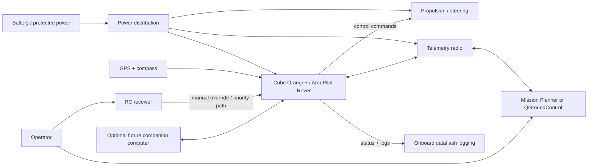

# Proposed control architecture

> **Proposed architecture; not yet integrated or tested.**

Bob 1 is intended to use established small-USV autopilot hardware and open-source vehicle-control software rather than developing custom low-level vehicle-control software for the first prototype.

## Proposed stack

- **Flight controller:** CubePilot Cube Orange+ running **ArduPilot Rover (boat frame)**.
- **Alternative flight controller:** Holybro Pixhawk 6X.
- **Position/heading:** GPS + compass module.
- **Telemetry:** Radio link between Bob 1 and the ground station.
- **Manual override:** RC transmitter/receiver with priority over supervised autonomy.
- **Ground control software:** Mission Planner or QGroundControl for route planning and monitoring.
- **Onboard logging:** ArduPilot dataflash logs.
- **Environmental protection:** Waterproof electronics enclosure.
- **Future option:** Companion computer for later perception or higher-level autonomy work.

The Cube Orange+ and Pixhawk 6X are proposed options and have **not** been purchased.

## Rationale

ArduPilot Rover supports boat operation, waypoint missions, failsafe configuration, operator control, and onboard logging. Using an established autopilot stack reduces the need to create custom low-level steering, navigation, and logging software before the project has validated the basic platform.

## Block diagram

## Relationship to existing electrical material

The existing repository contains an original system block diagram and references to electrical schematics, but those materials do not establish a tested or approved autopilot configuration.

No component-level conflict is confirmed from the public documentation alone. Before procurement or integration, the project must resolve the following known architecture gaps and check for conflicts with the existing electrical design:

- the existing high-level control/processing concept has not yet been reconciled to the proposed Cube Orange+ / Pixhawk 6X architecture;
- flight-controller input-voltage and protected-power path;
- propulsion/steering command interfaces;
- GPS/compass interface and mounting assumptions;
- telemetry-radio power and data interface;
- RC manual-override path and priority behavior;
- grounding, fusing, connectors, and waterproof enclosure penetrations;
- space, mounting, and cable-routing requirements for the selected flight controller.

These are integration items to resolve, not confirmed defects in the existing drawings.

See [system-overview.md](system-overview.md) and [test-plan.md](test-plan.md).

## DoD procurement note

If DoD funding is pursued, component country-of-origin requirements will be reviewed before procurement.

## Sources

- ArduPilot Rover documentation: https://ardupilot.org/rover/
- ArduPilot boat configuration documentation: https://ardupilot.org/rover/docs/boat-configuration.html
- CubePilot Cube Orange+ product documentation: https://docs.cubepilot.org/user-guides/autopilot/the-cube-module-overview
- Holybro Pixhawk 6X documentation: https://docs.holybro.com/autopilot/pixhawk-6x
- Mission Planner documentation: https://ardupilot.org/planner/
- QGroundControl documentation: https://docs.qgroundcontrol.com/
