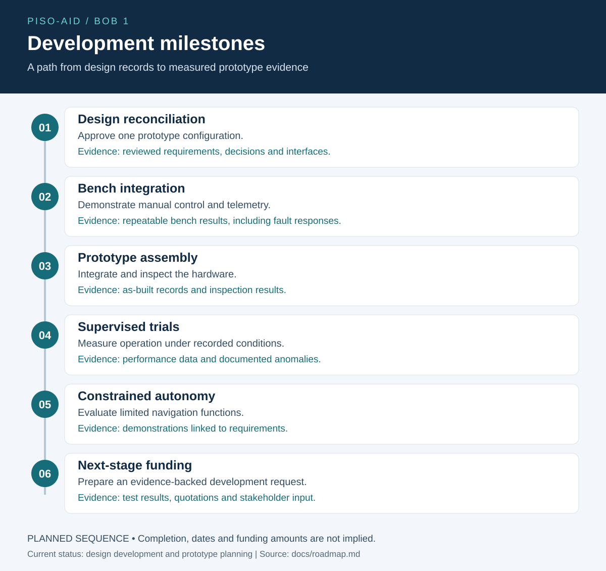

# Future funding overview
## Development objective
Move from an evolving design package toward a documented prototype demonstration with supervised operation, telemetry and measured results.

## Development milestones for prospective supporters

Support can be scoped to the work and evidence needed for each phase. This is a development plan, not a funding commitment or an assertion that earlier milestones are complete. See the [roadmap](roadmap.md).

## Potential uses of funding
Engineering review and design reconciliation; approved component procurement; fabrication; control and telemetry development; instrumentation; supervised testing; technical documentation.

## Evidence to prepare
A defined first mission and stakeholder need; approved requirements; costed work packages; dated supplier quotations; contributor and applicant roles; test methods; and a realistic delivery schedule.

## Present limits
No funding amount, opportunity eligibility, award, revenue forecast, customer commitment, payload or endurance claim is established here. Prospective applications will be matched to actual development progress and verified program requirements.

A private technical review package can support deeper discussions by arrangement. It includes the design review, detailed development records and references to controlled source materials; access to original assets is handled separately.

