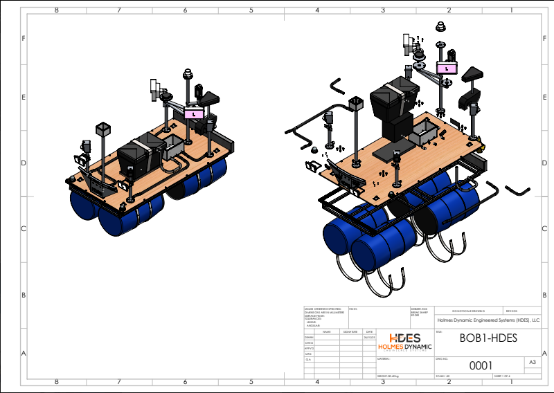
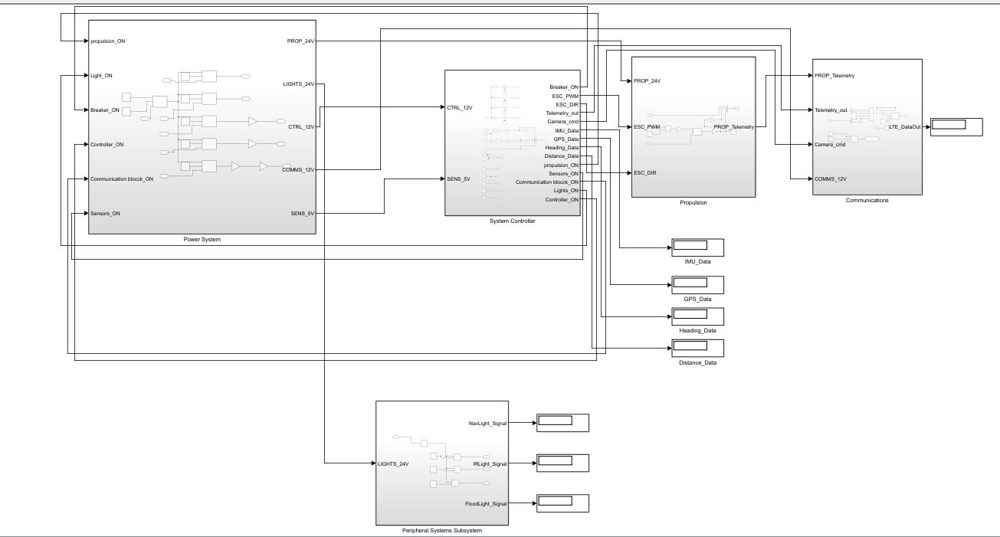
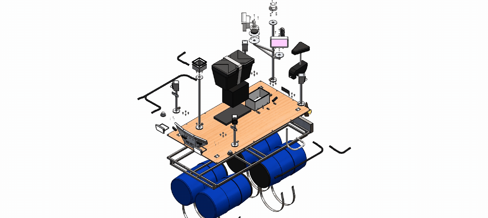

# System overview
Bob 1 combines a small pontoon structure, propulsion, battery power, onboard processing, sensors and an operator communications link.

| Element | Intended function |
|---|---|
| Structure and flotation | Support equipment and a defined experimental payload |
| Propulsion and steering | Enable controlled motion |
| Power | Supply monitored, protected electrical power |
| Sensors | Provide position, attitude and environmental observations |
| Control software | Support manual control and later constrained autonomy |
| Communications | Exchange commands, status and telemetry |
| Operator interface | Support supervision, intervention and recovery |

Final equipment selections and performance requirements remain under development. These functions describe design intent, not demonstrated capability.

## General arrangement

Design-reference view supplied by the project lead. Configuration and dimensions remain subject to engineering reconciliation.

## Original system block diagram

This source-design diagram does not establish tested software, final equipment selections or verified performance. [Open full-size diagram](../assets/bob1-system-block-diagram.png.PNG).

## Assembly visualization

The uploaded animation is a design visualization, not a validated assembly procedure.
