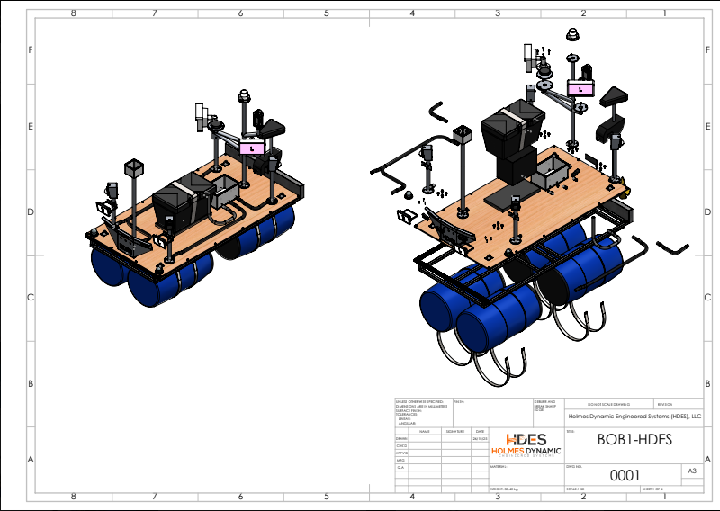
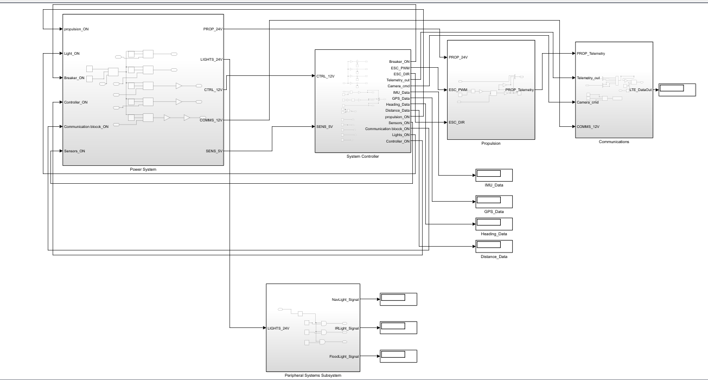

# System overview

Bob 1 combines a small pontoon structure, propulsion, battery power, onboard control hardware, sensors and an operator communications link.

| Element | Intended function |
|---|---|
| Structure and flotation | Support equipment and a defined experimental payload |
| Propulsion and steering | Enable controlled motion |
| Power | Supply monitored, protected electrical power |
| Sensors | Provide position, attitude and environmental observations |
| Control system | Support manual control and later supervised autonomy |
| Communications | Exchange commands, status and telemetry |
| Operator interface | Support supervision, intervention and recovery |

Final equipment selections and performance requirements remain under development. These functions describe design intent, not demonstrated capability.

See the [drawing register](drawing-register.md) for the full V03 package index and known reconciliation items.

## General arrangement

Design-reference view supplied by the project lead. Configuration and dimensions remain subject to engineering reconciliation.

## Original system block diagram

This source-design diagram does not establish tested software, final equipment selections or verified performance. It shows a 24 V propulsion and lighting bus; the current mechanical drawing package (drawing 0001) lists a 12 V motor and 12 V 100 Ah battery. That voltage conflict is a known reconciliation item, not a resolved design. [Open full-size diagram](../assets/bob1-system-block-diagram.png).

The proposed supervised-autonomy stack is documented separately in [control-architecture.md](control-architecture.md). It has not been purchased, integrated, or tested.

## Assembly visualization

The uploaded animation is a design visualization, not a validated assembly procedure.
